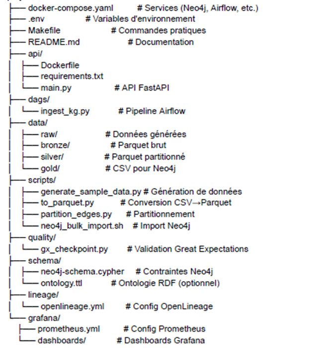
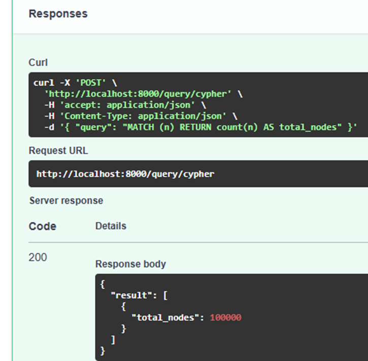
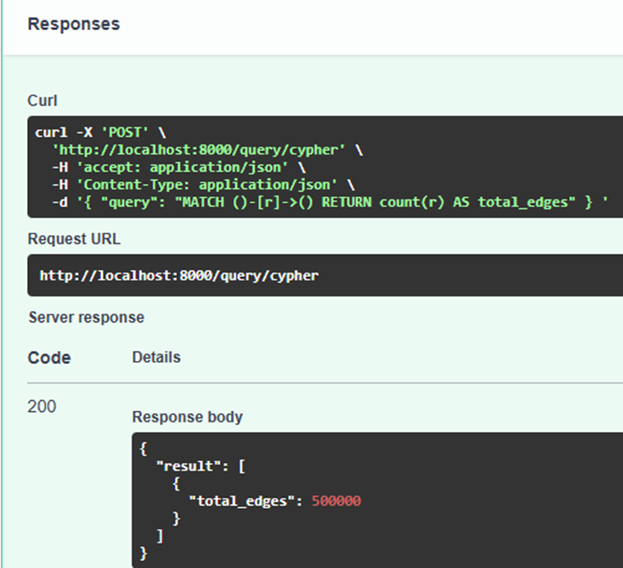
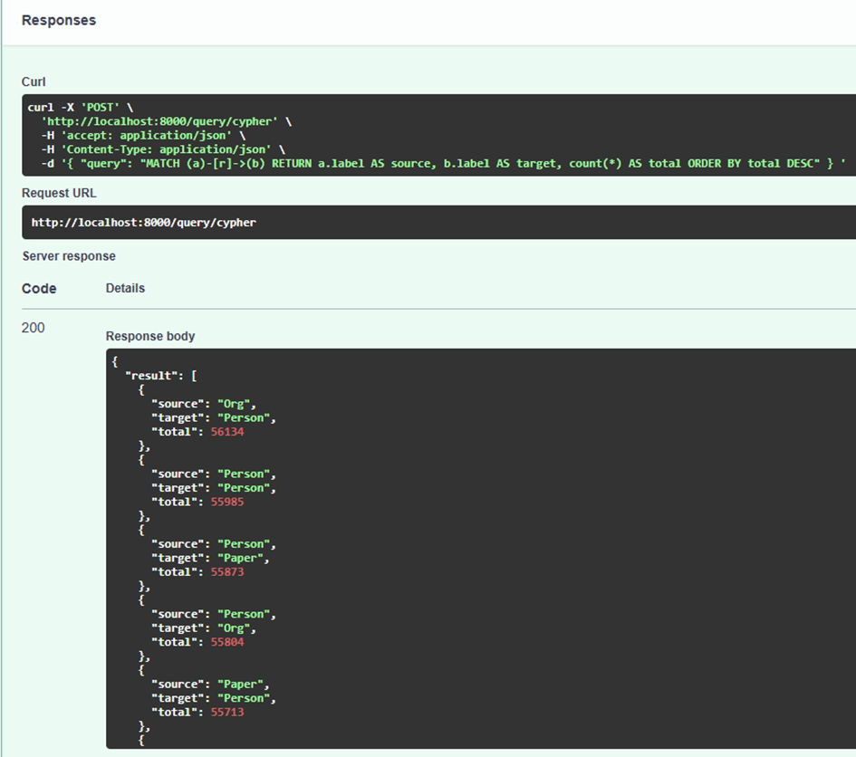
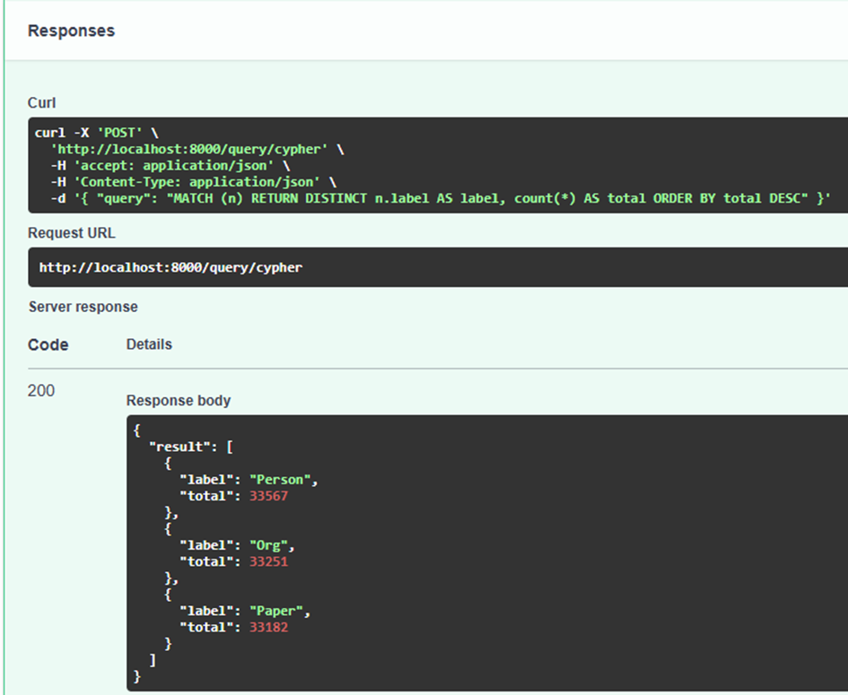
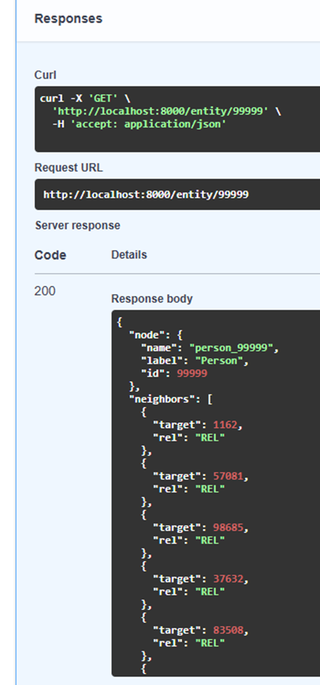
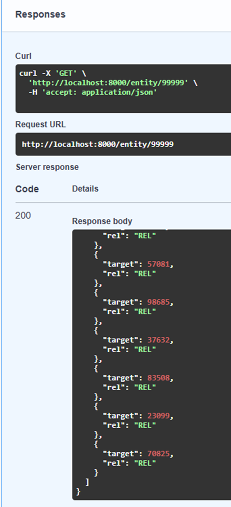

# Architecture Médaillon x Graphes de connaissances

Bonjour,
J’espère que vous allez bien. À travers ce README, je me permets de partager mon retour d’expérience sur la construction de ce projet Architecture Médaillon x Graphes de connaissances : Architecture Globale (Pipeline seed, Architecture Médaillon, Neo4j import) + Fast API.

## Introduction - Contexte 

- Lancement conteneurs(Airflow, Neo4j, Fast API) 
- L’accès aux services se fait par les ports exposés dans docker-compose.yml, y compris celui de Swagger pour FastAPI.
L’interface de la documentation API est disponible sur : http://localhost:8000/docs
- Le fichier ingest_kg.py contient le DAG Airflow qui, à l’aide de BashOperator, exécute les différentes étapes du pipeline.
- La partie Seed génère les données synthétiques.
- La partie Bronze convertit (comprime) les données brutes en fichiers Parquet.
- La partie Silver exécute la vérification de qualité et le partitionnement des relations (edges) en plusieurs shards via fonctions great_expectations.
- Finalement, la partie Gold crée les fichiers CSV nécessaires à l’importation et au chargement des données dans Neo4j.
- Une fois ces étapes terminées, la FastAPI permet de visualiser et analyser les données via des requêtes Cypher exécutées directement sur la base de graphes Neo4j.

## Utilisation et Configuration

Arborescence proposée par le exercice — dans mon cas particulier, j’ai ajouté un Dockerfile.airflow supplémentaire à la racine du projet. Cette arborescence contient d’autres dossiers pour continuer à développer ce projet ultérieurement:

- Créer un fichier .env à la racine du projet avec les variables :

- POSTGRES_USER=
- POSTGRES_PASSWORD=
- POSTGRES_DB=

- AIRFLOW_USER=
- AIRFLOW_PASSWORD=
- AIRFLOW_EMAIL=

- NEO4J_URI=bolt://neo4j:7687
- NEO4J_USER=
- NEO4J_PASSWORD=

- Avant tout ( Afin de construire et d’installer toutes les images et dépendances nécessaires à Airflow, Neo4j et FastAPI ), il faut lancer une première fois :

- docker compose build
- docker compose up -d

- Ensuite, il est possible d’utiliser la mécanique du Makefile :

- make up
- make down

- et de lancer les étapes du pipeline :

- make seed
- make bronze
- make silver
- make gold
- make e2e

## Dockerfiles:

Pour pouvoir exécuter Airflow avec Neo4j, j’ai dû créer une image Dockerfile pour Airflow. Dans ce Dockerfile, j’ai installé make et cypher-shell, ce qui permet à Airflow d’envoyer directement des requêtes à Neo4j sans devoir lancer un autre conteneur Neo4j depuis Airflow.

L’installation de cypher-shell se fait à travers les dépôts officiels de Neo4j pour Debian, comme indiqué dans la documentation.

- Pour Cypher Shell https://neo4j.com/docs/operations-manual/current/cypher-shell/
- Image Debian - Cypher Shell: https://neo4j.com/docs/operations-manual/2025.09/installation/linux/debian/

Cela a permis d’établir la connexion avec Neo4j depuis le conteneur Airflow et de réaliser les imports automatiquement à travers les tâches du pipeline.

## limites - conclusions

- Étant donné que ma machine ne dispose que de 4 Go de RAM, j’ai limité les tests à 100 000 nœuds et 500 000 relations.
Le code fonctionne correctement et peut être facilement étendu à des volumes supérieurs sur des machines avec plus de mémoire.

- La raison principale de l’utilisation de cypher-shell vient du fait qu’il était impossible de lancer un conteneur Neo4j depuis Airflow. Avec son installation directe dans le conteneur Airflow, la connexion avec Neo4j a pu être établie sans problème.

# VISUALISATION:

Pour vérifier le bon fonctionnement de FastAPI après le lancement de l’architecture dans Airflow et le chargement des données dans Neo4j,
j’ai effectué des requêtes Cypher afin d’interroger directement les données insérées dans Neo4j via le processus complet décrit précédemment:

## DAG Airflow - OK :

## INSERTION nodes et edges dans Neo4j OK:

## FAST API: 

1) GET /health : Santé de l'API

2) POST /query/cypher : Exécuter une requête Cypher
--------------------------------------------------------------
{ "query": "MATCH (n) RETURN count(n) AS total_nodes" }

---------------------------------------------------------------

{ "query": "MATCH ()-[r]->() RETURN count(r) AS total_edges" } 

--------------------------------------------------------------------------------------------------------------------
relations entre noeuds 

{ "query": "MATCH (a)-[r]->(b) RETURN a.label AS source, b.label AS target, count(*) AS total ORDER BY total DESC" } 

---------------------------------------------------------------------------------------------------------------------

nodes par type 

{ "query": "MATCH (n) RETURN DISTINCT n.label AS label, count(*) AS total ORDER BY total DESC" }

--------------------------------------------------------------------------------------------------------------------

3) GET /entity/{id} : Récupérer un noeud et ses voisins

