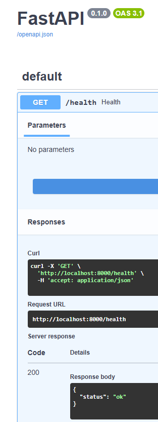

Pour vérifier le bon fonctionnement de FastAPI après le lancement de l’architecture dans Airflow et le chargement des données dans Neo4j,
j’ai effectué plusieurs requêtes Cypher afin d’interroger directement les données insérées dans Neo4j via le processus complet décrit précédemment:

1) GET /health : Santé de l'API

